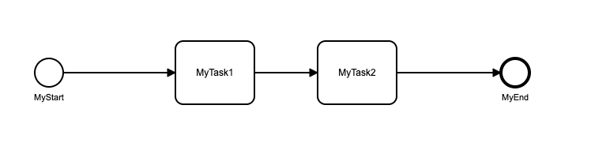
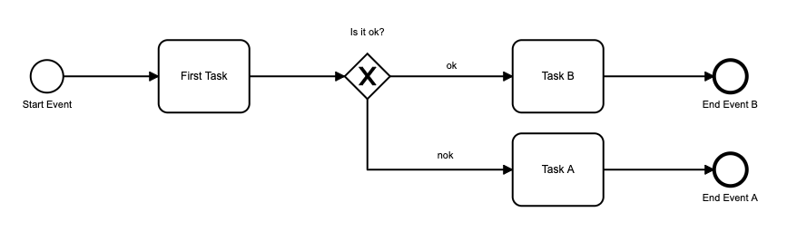

# Demo Project Using bpmn node package
https://www.npmjs.com/package/bpmn or https://github.com/e2ebridge/bpmn

A demo project for experimenting with bpmn based code execution solutions.

Since the used package is an old one, and it is no longer being updated by developers, it has some dependency issues. To solve this I decided to use it as a local dependency, in case I have to make any updates on the source code of the library.

Launch project with an example bpmn:
1. npm install on the bpmn folder
2. npm install on the bpmn-starter-project folder


Updates on bpmn library:
 - Winston dependency version fixed to "0.7.1 - 2.4.4"

<br>

# Experiences:

## 1. Tasks are not finished by their own - using process.taskDone



I experienced that, the process always stops and exists at the first task of the given workflow. The bellow example shows a process stopped at the middle without any warning. ( It also contains handler method calls. )

```
> node index.js
onBeginHandler
MyStart
onEndHandler
onBeginHandler
MyTask1
```
That is because no one is callink their taskDone method, so the task could not be considered as finished. After updating the file which starts the whole process with taskDone calls wrapped in timeouts for all tasks, the tasks are no longer considered unfinished, and the process could finally finish.

```
    myProcess.triggerEvent("MyStart");

    setTimeout(function(){
        myProcess.taskDone("MyTask1", {});
    }, 2000);

    setTimeout(function(){
        myProcess.taskDone("MyTask2", {});
    }, 4000);

```

The result including handler calls:
```
> node index.js
onBeginHandler
MyStart
onEndHandler
onBeginHandler
MyTask1
MyTask1Done
onEndHandler
onBeginHandler
MyTask2
MyTask2Done
onEndHandler
onBeginHandler
MyEnd
onEndHandler
```
## 2. From where to call process.taskDone method
Both two possible to call it from the process initializer callback method like abowe or from the handler method like this.taskDone("Task B",{}) since the context of the handler is the process itself.

## 3. How to work with gateways
The Is_it_ok handler fetches the data from the backend to evaluate the condition, and it passes the value in the data parameter to the ok and nok handler to evaluate.
<br>
**Note**: According to tha naming convention if the name of the gateway is "Is it ok?" the handler method should be called as "Is_it_ok_". All special characters are being replaced with underscore characters runtime.

```
exports.Is_it_ok_ = function(data, done) {
    console.log("Is_it_ok_");
    done("B");
};

// From the bellow two Is_it_ok handler only one should return true - only one edge can be executed
// Which handler returns true will be chosen to execute
exports.Is_it_ok_$ok = function(data) {

    console.log("Is_it_ok_$ok");
    return data == "B"
};

exports.Is_it_ok_$nok = function(data) {
    console.log("Is_it_ok_$nok");
    return data == "A"
};
```



